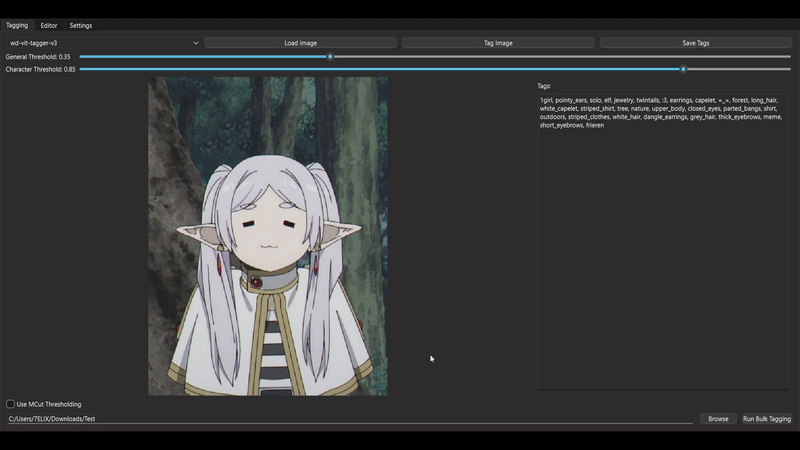

# Tag-Manager
[](https://www.python.org/)
[](https://opensource.org/licenses/MIT)

A desktop GUI application to **tag images** using the WaifuDiffusion-tagger models by [SmilingWolf](https://huggingface.co/SmilingWolf). Built with **Python** and UI in **PySide6**, it supports **single and batch tagging**, as well as a **tag editor** to manage tags efficiently.

<p align="center">
  
</p>

---

## Table of Contents

* [Features](#features)
* [Requirements](#requirements)
* [Installation](#installation)
* [Change History](#change-history)

---

## Features

### Tagging
- Uses models by **SmilingWolf's**
    - `wd-vit-tagger-v3`
    - `wd-vit-large-tagger-v3`
    - Of course you are free to use model of your choice.
- Supports single image tagging and bulk tagging
    - Bulk tagging works by specifying the path to the folder which contains your images
    - Click on Run Bulk Tagging button to start bulk tagging
- Mcut is supported

---

### Editor
- Add Tags, Delete Tags -- Manage them efficiently with the editor.
    - Currently:
        - You can delete a tag or delete that particular tag from all the files.
        - You can add a tag or add that particular tag to all the files.
- Supports Image preview

---

### Additional Features
- Toggle on/off from the settings:
    - Include Rating Tags: When toggled On it will also include rating tags in the output.
    - Exclude Character Tags: When toggled On it will exclude the character tags in the output.

---

## Requirements
- Ensure **Python ≥ 3.10** is installed.
- Other requirements are listed in [requirements.txt](https://github.com/ForgeL4bs/Tag-Manager/blob/main/requirements.txt)

---

## Installation

### Install using setup.bat/sh
Grab the setup.bat or setup.sh based on you system from the [release](https://github.com/ForgeL4bs/Tag-Manager/releases) page.
- **For Windows**
    - Simply run the setup.bat and it will do the rest of the work for you.
    ```bash
    ./setup.bat
    ```
- **For Linux/Mac**
    - Run (This adds the executable permission to the script)
    ```bash
    chmod +x setup.sh
    ```
    - Then you can simply run it.
    ```bash
    ./setup.sh
    ```
- **Model Downloading**
    - You can download the models using:
    ```bash
    ./download_models.bat #on windows
    ./download_models.sh #on linux/mac
    ```
    - You can also download the model from Huggingface and then put them in the models folder.
- **Running**
    - To run use:
    ```bash
    ./run.bat #on windows
    ./run.sh #on linux/mac
    ```

---

### Git Clone
**You can also git clone the repo and then run download_models.bat/sh and run.bat/sh to run**
1. **Clone**
```bash
git clone https://github.com/ForgeL4bs/Tag-Manager.git
cd Tag-Manager
```
2. **Activate virtual environment**
```bash
#For windows
python -m venv venv
venv\Scripts\activate
#For linux/mac
python3 -m venv venv
source venv/bin/activate
```
3. **Install dependencies**
```bash
pip install -r requirements.txt
```
4. **Run**
```bash
python main.py
```

## Change History

### 07/07/25

* Initial Release: v1.0